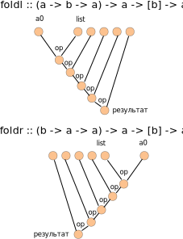

# Функциональное программирование

## Ссылки

* [haskell.org](http://haskell.org) для установки
* [wiki.haskell.org](http://wiki.haskell.org) много материалов для изучения
* [Haskell Wikibook](https://en.wikibooks.org/wiki/Haskell).
Читайте разделы в Haskell Basics: `Variables and functions`, `Truth values`, `Type basics`, `Lists and tuples`, `Next steps`.
В разделе Elementary Haskell: всё без `Types declarations` и без разделов о непонятном.
* Кубенский А.А. Функциональное программирование. Ищите на [library.spbu.ru](http://library.spbu.ru) или старая версия [Кубенский А.А. Функциональное программирование 2010](https://books.ifmo.ru/file/pdf/702.pdf)

### Лекции
Что мы успели изучить на лекции

[lectures1and2.hs](helloworld.hs)

[lists.hs](lists.hs)

[10 сентября часть 1](https://web.microsoftstream.com/video/58bd80a7-a57a-456a-a05d-fb7d7cc4855e)
[10 сентября часть 2](https://web.microsoftstream.com/video/d7d45f19-2b86-410f-9bf6-36165a981567)
[17 сентября часть 1](https://web.microsoftstream.com/video/d7d45f19-2b86-410f-9bf6-36165a981567)
[17 сентября часть 2](https://web.microsoftstream.com/video/c4db63cc-93af-4507-9993-a791481151f1)
[24 сентября](https://web.microsoftstream.com/video/5e1660a2-c8b0-46e0-9475-4f9b30e0b3d2)

### Вводные

Операции со списками

1. `length1` длина списка
1. `last1` возвращает последний элемент списка
1. `conc1` конкатенация списков
1. `push1` дописать элемент в конец списка
1. `repeat1 :: Int -> Char -> String` повторить элемент указанное число раз
1. `get1` получить элемент списка по его индексу
1. `rev1` перевернуть список
1. `take1` вернуть список, состоящий из указанного количества начальных элементов списка
1. `filter1` фильтрация списка. Оставить только те элементы, которые подходят под условие: `filter1 :: (a -> Bool) -> [a] -> [a]`

## Теория чисел

Пользуйтесь функциями обработки списков: `map`, `filter` и т.п.

1. Дано число, вывести список всех его положительных делителей.
1. Дано число, проверить его на простоту.   
   Воспользуйтесь предыдущей задачей, но не перебирайте список делителей полностью,
   проверьте только, какой делитель идёт после единицы.
1. Дано число, проверить, совершенное ли это число. Другими словами, верно ли что число
   равно сумме своих делителей, не считая себя. Например, 6 = 1 + 2 + 3.
1. Найдите все совершенные числа от 1 до миллиона
1. Решето эратосфена. Дано n, найдите все простые числа от 1 до n. Прочитайте алгоритм решета Эратосфена, и реализуйте его следующим образом: создайте список чисел от 2 до n, потом отделяйте от него первый элемент, фильтруйте остальные, которые на него делятся. Продолжайте это, пока список не кончится. Обсуждение решета Эратосфена и его реализации на Haskell см. учебник Кубенского.
1. Простые близнецы. Дано n, найдите все пары простых чисел от 1 до n, отличающихся на 2.

## Операции на списках

### `concatMap`

Следуюшие задачи нужно решить с помощью встроенной функции `concatMap`

3. Дан список, повторите каждый его элемент два раза.
1. Опять реализуйте `filter`
2. Реализуйте `map`

### `zip`, `zipWith` и `unzip`

Используйте функции zip, zipWith, unzip.

1. Реализуйте функцию zipWithIndex: к каждому элементу списка "припишите" его индекс. Т.е. каждый элемент списка должен превратиться в тьюпл, где вначале идет индекс элемента, а потом сам элемент. Начинайте считать элементы с нуля.
2. Сложите каждый элемент списка `[Int]` с его индексом.
3. Дан список `[Int]`, верните список, в котором все четные по счету элементы заменены на ноль
4. Дан список, удалите из него все элементы с четным индексом.
5. Дан список двузначных чисел. Верните тьюпл из двух списков: первые цифры чисел и вторые цифры чисел. Например, `[10, 44, 31]` превращается в `([1, 4, 3], [0, 4, 1])`.

### `foldl` и `foldr`

Решите каждую задачу с помощью одной из функций: `foldl` или `foldr`.
Обычно с помощью одной из этих функций решение проще и естественней.
Иногда хорошее решение можно получить обеими функциями,
в этом случае попробуйте решить одну задачу двумя функциями.

Обратите внимание, что разные задачи в этом блоке имеют очень похожие решения, они отличаются буквально в одной
операции. Найдите такие задачи с похожими решениями.

1. Посчитайте количество элементов в списке
2. Переверните список
3. Припишите один список к другому (операция `++`)
4. Реализуйте функцию `filter`
5. Реализуйте функцию `map`
6. Реализуйте функцию `concatMap`. Она имеет тип: `(a -> [b]) -> [a] -> [b]` и делает следующее: `concatMap f l` применяет функцию `f` к каждому элементу списка `l` и получает списки. Все полученные списки объединяются в один.
7. Реализуйте `foldl` через `foldr`. И потом наоборот. (Подсказка: переворачивание списка мы делали через foldl, поэтому его можно использовать во втором случае)
8. Напишите функцию `minmax`, которая возвращает минимальный и максимальный элемент списка в виде Tuple.

## Несколько задач на алгоритмы

Эти задачи не на конкретные функции или приемы, а на то,
как запрограммировать что-то содержательное. Вы можете
использовать всё, что мы проходили о Haskell.

1. Алгоритм быстрого возведения в степень. Положим, нам нужно вычислить \\(x^n\\). Запишем следующее равенство:
$Answer = a^b \\cdot c$. Оно верное, если \\(a = x\\), \\(b = n\\), \\(с = 1\\).
Теперь выполняем следующие шаги:
    * Если \\(b\\) четно, то заменяем \\(a \\rightarrow a^2\\), а \\(b \\rightarrow b/2\\). Теперь \\(Answer = (a^2)^{b/2}\\cdot c\\)
    * Если \\(b\\) нечетно, то заменяем \\(b \\rightarrow b-1\\), \\(с \\rightarrow c\\cdot a\\). Теперь \\(Answer = a^{b-1} \\cdot (a \\cdot c)\\)

    Когда \\(b\\) станет равно нулю, мы получим \\(Answer = a^0 \cdot c\\), т.е. ответ это \\(c\\).
    Реализуйте этот алгоритм функционально, с хвостовой рекурсией

1. Быстрая сортировка
    1. Напишите функцию, которая по списку и заданному числу возвращает три списка в виде Tuple: все элементы, меньшие `v`; все элементы, равные `v`; все элементы, большие `v`.
    1. Напишите функцию, которая сортирует массив рекурсивно: Вызывает функцию из предыдущего пункта для первого элемента массива. Рекурсивно сортирует первый и третий списки, соединяет их опять в один список.
    
1. Сортировка слиянием.
    1. Напишите функцию, которая делит один список на два одинаковой длины. Или почти одинаковой, если длина нечетна. Просмотртие список функций по работе со списком из стандартной библиотеки, чтобы найти какую-нибудь функцию, которая в этом поможет.
    1. Напишите функцию, которая сливает два отсортированных списка в один отсортированный. Сделайте это рекурсивно, откусывая по одному элементу с начала каждого из списков.
    1. Теперь сама сортировка. Разделите заданный список на два равной длины. Рекурсивно сортируйте оба эти списка, потом слейте их вместе
