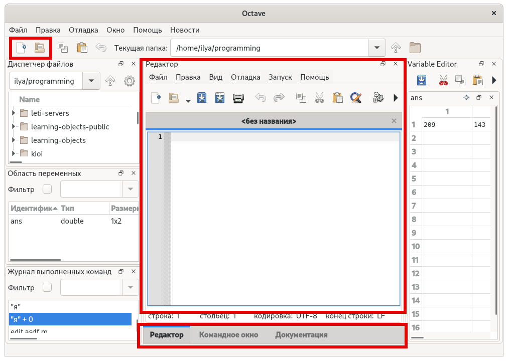

# Functions and scripts

It is not handy to use Octave only by typing expressions in a command line. Sometimes
you want to repeat a long series of commands. It is possible to write commands inside
a file and ask Octave to run commands from this file.

Let's create a script. Open a text editor
  - It may be any editor, for example notepad, notepad++, atom, sublime, etc. There are a lot.
  Although, I don't recommend pure Notepad in Windows.
  - It may be the editor built in Octave. This is the preferred way to work, because it is inside
  the Octave, so you don't need to switch applications between the editor and the Octave.
  
Here is the built-in editor:



It is marked with a big red rectangle. To open the editor, press
one of the buttons at the top left. They create a new file or open
an existing one. You may find the same actions in the "File" menu.

After you create a new file, write the following code inside it.
Please copy the code to make sure every symbol is the same as in the example:

```
a = 2 * ones(3)
b = 3 * eye(3);
a + b
```

Then save the file to some folder, and remember which folder it is.
Let us name the file `script1.m`, the `.m` extension
is used for Octave code.

Then you should select that folder inside Octave. There are two ways to do it:

1. Issue a command `cd "C:\my-octave-folder"`, but put your own path instead of my example.
1. Select your folder in the top left window inside Octave GUI. You should see your file
`script1.m` inside that window.

After you changed the folder, issue a command `pwd` to check that octave has
correctly changed its folder.

## Running the script

To run a script just type `script1`. It is the name of the script. Octave will look inside
the current folder for the file named `script1.js`. Then it will just run the script.

Note the difference between the lines inside the script that end with a semicolon `;` and
with the lines that do not. If a line **does not** have a semicolon at the end, the result
of its evaluation prints to the console. In our example after running the script you will
see the value assigned to `a` and then the sum of `a` and `b`. And you will not see the value
assigned to `b`, because the corresponding line has a semicolon at the end:

```
a =

   2   2   2
   2   2   2
   2   2   2

ans =

   5   2   2
   2   5   2
   2   2   5
``` 

So, I ask you to put semicolons at the end of each line with evaluations. You can remove
semicolons for debug purposes, but please put them back before submitting a task.

## Functions

I ask you to write functions instead of scripts, when you solve tasks. The reason is
that in almost every task you have some input parameters.

Please, read about functions here: [octave functions](https://octave.org/doc/v4.0.1/Defining-Functions.html) or in books.
