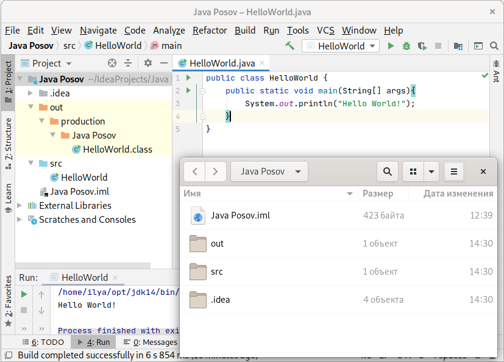
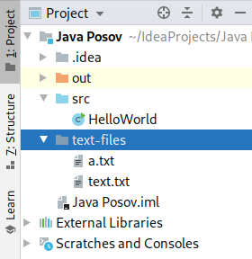
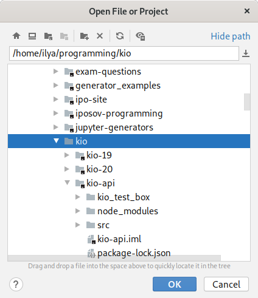
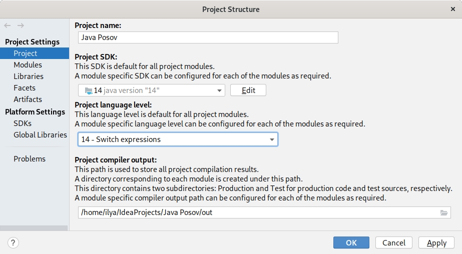

# Проект в IntelliJ IDEA

Я отдельно хочу обсудить, что такое проект в IntelliJ IDEA и как он устроен.
Эти знания помогают решать проблемы, когда IDEA работает
неправильно, а программы в ней не запускаются. Практика показывает, 
что проблемы с IDEA встречаются часто, а преподаватель, который может их
решать, не всегда находится рядом.

## Как проект устроен на диске

Слева в IDEA вы видите файлы и каталоги проекта так же, как они
расположены у вас на диске. Сравните открытый проект и открытый каталог:



Какие файлы и каталоги есть в каталоге проекта:

### Каталог `src`
Это каталог с исходными файлами, именно туда нужно
складывать все java файлы, которые вы пишете. `src` специально помечен
для этого синим цветом, если он не синий, значит, с проектом что-то
не так, и файлы оттуда запускаться не будут. Мы ниже увидим, где
настраивается, в каких папках лежат исходники. 

Скопируйте в `src` все свои программы, которые вы успели написать с начала
семестра, если вы это еще не сделали.
    
В каталог `src` можно класть только исходные коды, т.е. java файлы.
Поэтому убедитесь, что вы не положили туда никаких bat файлов,
class файлов, никаких файлов, которые читает или пишет ваша программа.

### Каталог `out`
В каталог `out` помещаются результаты компиляции программ, поэтому вы
видите там файл `HelloWorld.class`. Этот каталог не является частью
проекта, в том смысле, что он не важен для проекта - его можно очистить,
и это не помешает проекту работать. При следующем запуске программы,
исходники заново скомпилируются, и в этом каталоге появятся свежие class
файлы.

Каталог `out` помечен красным. Если нет, значит опять что-то не так
с проектом, и его надо настроить. Про это ниже.

Если вы шлете другу или мне каталог проекта, вы можете сильно
сэкономить в размере архива, если не будете помещать в него каталог `out`.

### Каталог `.idea`
Каталог `.idea` содержит настройки проекта. Из всех настроек
проекта мы пока видели только одну, какой JDK нужно пользоваться.
Мы выбирали это при создании проекта.

В качестве упражнения, откройте каталог `.idea` внутри IDEA, переберите
файлы в этом каталоге и найдите, где записано, какое JDK назначено
вашему проекту. 

Лучше всего этот каталог не трогать и 
относиться к нему бережно. Это важная часть проекта. Не удаляйте его, 
не изменяйте вручную его содержимое, перемещайте вместе с каталогом
проекта.

### Файл `.iml`
В корне проекта вы найдете файл с расширением `.iml` и названием,
совпадающим с названием проекта. Это файл модуля:

Проект в IDEA состоит из модулей. Они необходимы, если вы разрабатываете
большой проект, состоящий из нескольких обособленных частей. Например,
у вас может быть веб-проект, где отдельно вы программируете сервер на PHP,
а отдельно интерфейс на HTML и JavaScript. Или программа, где часть
кода написана на Java, часть на Python. Или же программа настолько
большая, что вы разделяете ее на несколько отдельных частей, написанных
на Java.

Мы не будем писать таких больших программ, поэтому у нас проекты
будут состоять из одного модуля. Ниже мы увидим настройки модуля,
когда будем рассматривать настройки проектов.

Относитесь к `.iml` файлу так же, как и к каталогу `.idea`, это настройки
вашего проекта. 

### Другие файлы в каталоге проекта

Вы можете класть в каталог проекта любые другие файлы. Например, 
мы часто пишем программы, которые читают и пишут данные в файлах.
Кладите эти файлы либо напрямую в каталог проекта, либо, если
их много, создайте подкаталог:



Частая ошибка — класть такие файлы в каталог `src`. Это неправильно,
потому что вы не планируете их компилировать.

При запуске программ из IDEA по-умолчанию рабочим каталогом считается
каталог проекта, поэтому внутри программ при ссылке на файлы вы должны
указывать их относительный путь для каталога проекта:

```
with open("a.txt", "r", encoding="utf8") as f:
    pass
```

или 

```
try (Scanner in = new Scanner(
        Paths.get("text-files/a.txt"), // или Paths.get("text-files", "a.txt")
        StandardCharsets.UTF_8
)) {
    //do something
} 
```

## КАК IDEA находит каталоги проекта

По каталогу `.idea` IDEA находит свои проекты.
Она считает, что проект — это любой каталог, внутри которого
есть подкаталог `.idea`. Поэтому если вы его сотрете, IDEA перестанет
    считать ваш проект проектом.
    
На следующем рисунке показан диалог открытия файла или проекта. Его
можно открыть через меню File, пункт Open.
    

    
Обратите внимание, что некоторые каталоги на иконке имеют черный
квадратик. Это каталоги проектов, у них внутри есть подкаталог
.idea. Он может быть невидимым здесь в списке, но он есть.

Если вы в этом диалоге откроете каталог с проектом (с черным квадратом),
то вы откроете проект. Если откроете файл, то просто увидите содержимое
файла. А вот если откроете каталог без черного квадрата, случится следующее.
IDEA создаст проект в этом каталоге. Это очень часто приводит к
проблеме, студент думает, что открывает свой проект, но в реальности
открывает какой-то другой каталог, например, src внутри проекта.
В результате создается новый не настроенный проект, в нем ничего
не работает, хотя файлы java с кодом программ видны. Будьте аккуратны.

Если вы поняли, что открыли не тот
каталог, закройте проект, откройте правильный каталог с проектом,
и сотрите лишний каталог `.idea`, который образовался из-за неверного
открытия.

## Диалог Project Structure

Диалог Project Structure с настройками проекта можно открыть кнопкой,
которая находится справа сверху:


или через меню File.

В PyCharm или других версиях IDEA аналогичные настройки будут в других
диалогах, но все равно где-то будут, и вы сможете найти их при желании.

Первая вкладка слева "Project":
 
 
Здесь мы видим
 1. Имя проекта
 2. JDK, которую вы используете для проекта.
 
    **Проверяйте эту настройку. Часто, особенно при перемещении 
    проекта между компьютерами, здесь либо не указан никакой JDK,
    либо указан неправильный. Из-за этого код всех программ
    подсвечивается красным и не запускается**.
 3. Language Level. Версия языка. Обычно здесь должна быть версия языка,
 совпадающая с версией JDK. Но может быть и более ранняя версия.
 Т.е. вы можете с помощью JDK 14 программировать на Java 8 версии.
 
     **Иногда бывает, что здесь выбрана очень старая версия языка, и вы
 не можете написать в программе, например, `var x = 42`, потому что ключевое
 слово `var` появилось только недавно в 10 версии Java.**

4. Каталог, куда складываются результаты компиляции. Здесь указан
 известный нам каталог `out`.
 
    **Частая проблема — этот каталог не указан, или указывает в несуществующее
 место**. 

Вкладка Modules:


Здесь настраиваются отдельно все модули проекта. Как я говорил раньше,
у нас практически всегда будет ровно один модуль в проекте. Действительно,
на снимке мы видим один модуль `Java Posov` в списке. Он называется
так же, как проект.

**Частая проблема: модулей в списке нет вообще, или их в списке слишком
много**.
Для решения удалите лишние модули кнопкой минус над списком модулей или
добавьте модуль кнопкой плюс. При добавлении модуля вы должны либо
создать новый модуль, этот процесс практически совпадает с процессом
создания нового проекта. Либо вы можете "импортировать" уже существующий
модуль. Второе работает, когда у вас есть `.iml` файл, но он почему-то
не подключен к проекту.

### Настройка модуля
