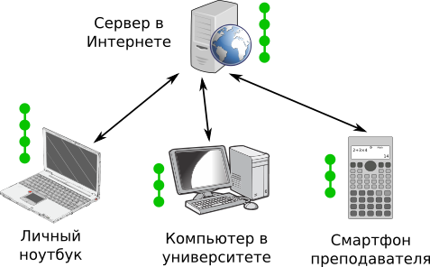
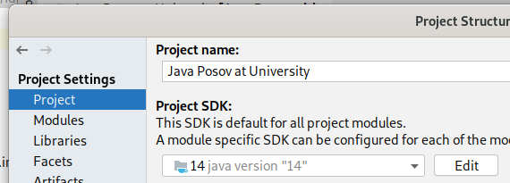
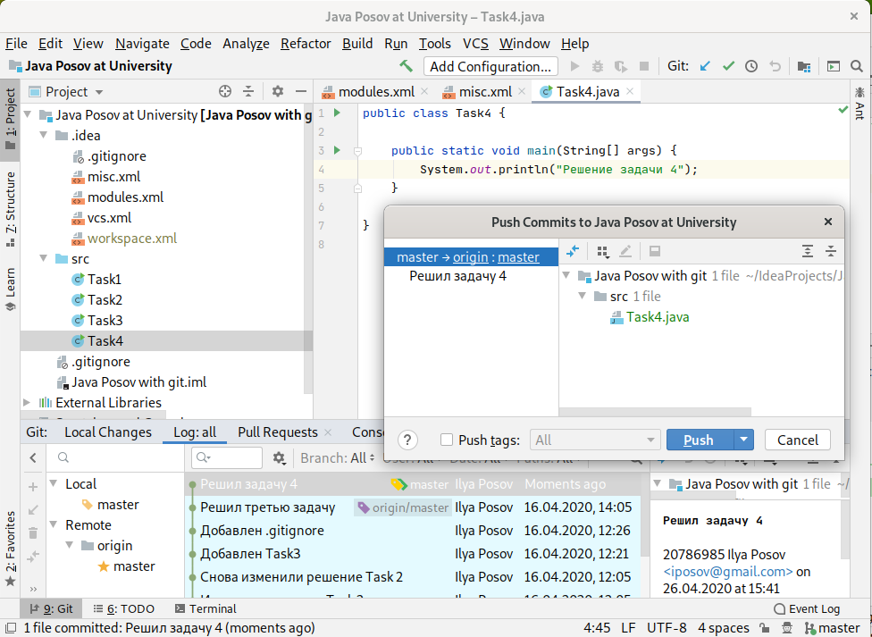

# Несколько клонв репозитория

На данный момент у нас есть локальный репозиторий
с проектом на нашем компьютере и репозиторий
на GitHub. Мы решаем задачи на компьютере, фиксируем (commit) изменения, получаем
ревизии и периодически отсылаем их в репозиторий на GitHub.

**Важно**. Убедитесь, что в вашем проекте нет незафиксировнных изменений. Т.е. в окне
Git вкладка Local Changes должна быть пустой. Иначе либо зафиксируйте (commit) изменения и отправьте (push)
их на GitHub, либо откатите все изменения после последнего коммита.
Вот как можно откатить:

Во вкладке Local Changes, если нажать на файл, можно
увидеть справа, что именно изменилось в файле
с последнего коммита. Или если окно справа для вас слишком маленькое, нажмите два раза
на файл, он откроется в редакторе, и там вы увидите с помощью пометок слева от кода, что именно изменилось.
На каждую пометку можно нажать и вернуть всё как было.

Другой вариант — операция Rollback. Нажмите ее на любом файле или даже каталоге, выберите Rollback
(или, в зависимости от меню, сначала Git потом Rollback),
тогда файл или каталог полностью удалит все изменения.

Итак, **перед тем как идти дальше, убедитесь, что у вас нет незафиксированных изменений, и все
ревизии с локального компьютера отправлены на GitHub**. Чтобы еще раз гарантированно убедиться, сделайте
Push и проверьте, что больше на GitHub новые ревизии не отправляются.

Что случится, если вы не выполните эти действия? Вам потом будет труднее получить изменения, которые
мы сделаем в другом клоне репозитория. Сложно, когда вы что-то изменили, и в другом месте что-то изменили,
надо будет как-то совмещать изменения. Мы обязательно научимся это делать, но пока давайте упростим
себе жизнь и не будем совмещать изменения из разных мест.  

## Клонирование репозитория

Давайте получим копию репозитория еще на одном компьютере. Как будто бы мы пришли
в университет, а личный ноутбук остался дома. Так как на самом деле мы не можем
сейчас идти в университет, вместо другого компьютера сделаем клон репозитория
в другом каталоге. У вас будет два каталога с одним и тем же проектом.
Если у вас дома два компьютера, можете попробовать проделать всё на другом. Не забудьте только
установить там, Java, Git, Jetbrains Toolbox, Idea. И настроить их.

Выберите в меню VCS пункт "Get From Version Control...":

Выберите, что вы пользуетесь Git, потом введите URL своего репозитория. Его можно найти
на сайте GitHub, если нажать на зеленую кнопку "Clone or download":

В конце введите каталог, куда скачается проект. Отнеситесь серьезно к выбору каталога, чтобы не
запутаться потом, в каком каталоге у вас исходный проект, а в каком — новый клонированный с GitHub.
Я, как видно, назвал новый каталог "Java Posov at University", как будто бы это каталог
на компьютере в Университете.

На картинке ниже виден клонированный проект, он состоит из тех же файлов, что и исходный,
в журнале (log) Git видны те же ревизии. От исходного проекта новый можно отличить заголовком окна:

## Возможные проблемы с настройками проекта

Если вы клонируете проект на тот же компьютер, на котором
его создали, скорее всего проект заработает сразу.
Если вы клонируете на другом компьютере, возможно,
придется поправить настройки проекта. О настройках
IDEA у нас есть отдельная глава.

Вероятней всего, собьется настройка SDK, это настройка о том, из какого каталога
брать установленную Java. Ясно, что на разных компьютерах каталоги разные.
Настройка SDK находится в диалоге Project Structure, и, скорее всего, IDEA сама
вам ее откроет, когда поймет, что с SDK какие-то проблемы:

Видно, что у меня настроены несколько SDK, для Java версий 14, 11 и 1.8. Выбрана
SDK с названием 14, и для нее установлен каталог /home/ilya/opt/jdk14.
Название для SDK я написал специально такое простое "14", чтобы я мог сделать SDK
с тем же названием на другом компьютере. Но на другом компьютере я укажу другой
каталог, где установлена Java.

Зачем это всё? IDEA хранит для проекта не сам каталог, а имя SDK. Т.е. в каталоге .idea, который 
хранится в репозитории, записано, что вы пользуетесь SDK с именем, например, "14".
И, когда вы клонируете проект на другом компьютере, он получит тот же каталог .idea, а следовательно
и тот же SDK с названием 14. Следующий рисунок напоминает, где выбирать SDK для проекта:

## Изменяем что-нибудь в проекте в Университете

При первом прочтении всего, что будет дальше, не повторяйте сами никаких действий.

На компьютере в университете ... Постоянно проверяйте, где вы выполняете действия, откройте два окна
с IDEA проектами, домашнем и университетским, и постоянно смотрите на заголовок. К сожалению, если вы сейчас
сделаете что-то не так, как я напишу, например, сделаете commit не в том проекте,
вам будет трудно вернуть всё к прошлому состоянию. Это возможно, но надо знать то, что вы еще не успели
прочитать ... так вот, на компьютере в Университете сделайте какие-нибудь изменения, например, создайте
класс `Task4`, как будто вы решаете еще одну задачу, потом сделайте commit с этим файлом и push на GitHub:

Здесь показано, как выглядит интерфейс за секунду до Push на GitHub. В редакторе открыт новый класс,
снизу в журнале видно, что уже создана новая ревизия с комментарием "Решил новую задачу". На эту
ревизию ссылается ветка `master`, а ветка `origin:master` ссылается на предыдущую ревизию. Напомню, 
что `origin` — это репозиторий на GitHub. В прошлый раз мы настраивали имя `origin` вручную, а в этом
репозитории `origin` автоматически ссылается на GitHub потому что это именно то место, с которого мы
этот репозитрий клонировали.

В общем, когда мы нажмем на Push, новая ревизия отправится на GitHub. Ветка `origin:master`
тоже переместится на новую ревизию. Если вы откроете в браузере свой репозиторий на GitHub,
сможете убедиться, что туда всё отослалось.

## Обновление проекта

Пора вернуться домой, открыть домашний проект, с которого мы начинали, и попытаться забрать новую
ревизию с GitHub.

Очередной раз убедитесь, что у вас нет никаких изменений в файлах после последнего коммита. Откатите
все изменения, если они есть: вручную или через rollback. **Тем более не фиксируйте сейчас
никаких изменений**. Список локальных изменений (Local Changes)
должен быть пустым. **Пусть у вас появится привычка убеждаться перед обновлением, что в репозитории
нет локальных изменений**. Это не значит, что их нельзя иметь, но вам придется
договариваться с IDEA, что с ними делать: сохрнить отдельно, совместить с проектом после обновления.
На данном этапе проще не иметь изменений и не думать о них.

Обновляем! Выберите     
